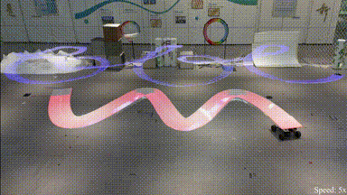

# CoNi-MPC: Cooperative Non-inertial Frame Based Model Predictive Control
<p align="center">
  
</p>

## Introduction

CoNi-MPC, **Co**operative **N**on-**i**nertial Frame Based **M**odel **P**redictive **C**ontrol,  is a control framework to control the quadrotor flying in a non-inertial frame using non-linear model predictive control.
This repo contains the necessary code and dependencies to run it.

If you are interested in this project, you can find more on the project webpage:
- https://fast-fire.github.io/CoNi-MPC/ 

and there's a preprint version for this project on arXiv:
- https://arxiv.org/abs/2306.11259

If you find this project useful for your own research work, 
please cite it with:
```text
@article{zhang2023coni,
  title={CoNi-MPC: Cooperative Non-inertial Frame Based Model Predictive Control},
  author={Zhang, Baozhe and Chen, Xinwei and Li, Zhehan and Beltrame, Giovanni and Xu, Chao and Gao, Fei and Cao, Yanjun},
  journal={arXiv preprint arXiv:2306.11259},
  year={2023}
}
```

## Prerequisites
- ACADOtoolkit (https://acado.github.io/)

First, clone this repo
```bash
git clone https://github.com/FAST-FIRE/CoNi-MPC.git
```
After cloning the repo, there are some dependencies that you should install 

### Install `gflags`
```
sudo apt install libgflags-dev
```

## Build

Before you proceed, you need to first go to the directory `coni_mpc/acado_model/` to check the code of the MPC model (in ACADO) is successfully built. Please read the README file in that directory in advance. The generated MPC code is contained in this directory. **If you find that setting up the ACADO environment is tedious, you can safely ignore this part.** However, if you want to modify the MPC model for your purpose, we recommend you to refer ACADO's documentation and try to build and generate the code yourself. In that way, you will manage your building process. 


After you install the dependencies, you can use 
```bash
catkin_make -DCMAKE_BUILD_TYPE=Release
```
to build the packages

Sometimes, if you face some Python issues, you may add `-DPYTHON_EXECUTABLE=/usr/bin/python3` to build. 

## Run 
We provide a sample numerical simulation node for your reference. To start this simulation, run 
```bash
source devel/setup.bash
roslaunch coni_mpc num_sim_non_one_point.launch r:=1.0 v:=1.0 w:=1.0
```
This will let the car run with a linear velocity of 1.0 m/s and an angular velocity of 1.0 rad/s. There will be two rviz panels indicating the relative frame and the world frame. The quadrotor (agent) will follow a point (-1.0 m, 0.0 m, 2.0 m) at the back of the car (target).

## Credits

This project is inspired by the code presented in `Davide Falanga, Philipp Foehn, Peng Lu, Davide Scaramuzza: PAMPC: Perception-Aware Model Predictive Control for Quadrotors, IEEE/RSJ Int. Conf. Intell. Robot. Syst. (IROS), 2018`.

We adopt some of the code in the [rpg_mpc](https://github.com/uzh-rpg/rpg_mpc) repo and make modifications. The files below are similar to those in `rpg_mpc`
- `acado_model/quadrotor_model_thrustrates.cpp`
- `include/acado_mpc/mpc_params.h`
- `include/acado_mpc/mpc_wrapper.h`
- `include/acado_mpc/mpc_controller.h`
- `src/acado_mpc/mpc_wrapper.cpp`
- `src/acado_mpc/mpc_controller.cpp`
